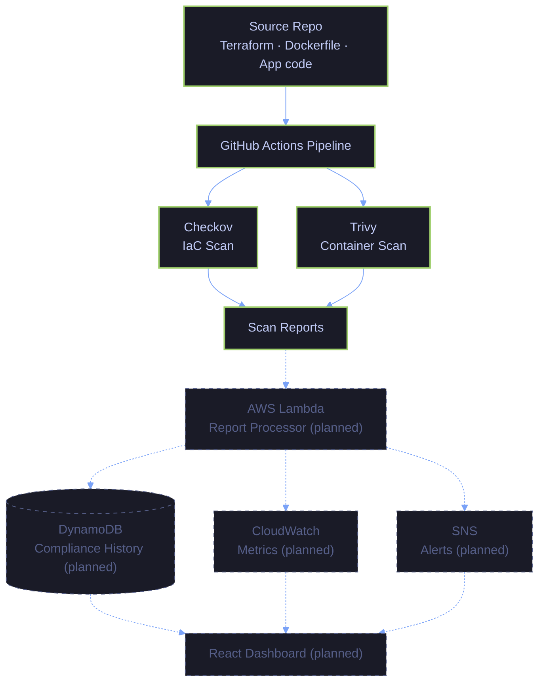

<div align="center">


<a href="https://github.com/priyanshisaugat01">
  
</a>

<p><i>Aspiring Cloud &amp; DevOps Engineer — turning infrastructure into code, and code into compliance, one pipeline at a time.</i></p>


<br/><br/>

<b>
<a href="#about">About</a> ·
<a href="#philosophy">Philosophy</a> ·
<a href="#projects">Projects</a> ·
<a href="#tech-stack">Tech Stack</a> ·
<a href="#roadmap">Roadmap</a> ·
<a href="#analytics">Analytics</a> ·
<a href="#connect">Connect</a>
</b>

</div>

<br/>

<a id="about"></a>

## 🧭 About Me

I'm a **Computer Science student** currently learning **Cloud & DevOps**, with a strong interest in **aviation infrastructure and monitoring systems**. I like understanding how large, safety-critical systems stay reliable — and I'm building my skills toward exactly that.

```yaml
name:        Priyanshi Saugat
role:        Computer Science Student
focus:       Cloud Infrastructure · DevOps · Site Reliability
currently:   Building SkyShield — DevSecOps compliance automation for aviation infra
philosophy:  Learn by building — projects, deployments, debugging, real infra
```

- 🎓 Computer Science student, learning Cloud & DevOps fundamentals in depth
- ✈️ Deeply interested in aviation infrastructure and monitoring/observability systems
- 🔭 Currently building **SkyShield**, a DevSecOps compliance automation platform combining Terraform, Checkov, Trivy, and GitHub Actions
- 🛠️ I learn by *doing* — most of my growth comes from projects, deployments, debugging, and hands-on experimentation with cloud infrastructure, not just theory
- 🌱 Actively expanding into Site Reliability Engineering and aviation-domain infrastructure design

<br/>

<a id="philosophy"></a>

## 🧠 Engineering Philosophy

<table>
<tr>
<td width="50%" valign="top">

**⚙️ Automation**
Anything done manually more than once is a candidate for a pipeline. Manual steps are where compliance gaps and human error hide.

**🏗️ Infrastructure**
Infrastructure should be defined as code, reviewed like code, and versioned like code — not clicked together in a console.

</td>
<td width="50%" valign="top">

**🔐 Security**
Security checks belong *in* the pipeline as an enforced gate, not as a checklist reviewed after something is already deployed.

**📈 Observability**
You can't fix — or trust — what you can't see. Metrics, logs, and alerts come before optimization, not after.

</td>
</tr>
</table>

> 🌱 **Continuous learning:** I'd rather ship something small and real, learn from how it actually behaves, and iterate — than wait until I feel "ready" to start.

<br/>

<a id="projects"></a>

## 🛠️ Featured Projects

<a id="skyshield"></a>

### 🛡️ SkyShield — DevSecOps Compliance Automation for Aviation Infrastructure


**Problem**
Aviation infrastructure operates under strict regulatory and safety requirements, yet Terraform misconfigurations, vulnerable container images, and leaked secrets routinely slip past manual review and aren't caught until after deployment. SkyShield automates security and compliance validation of cloud infrastructure and container artifacts *before* they reach production — replacing ad-hoc manual review with continuous, auditable scanning built directly into the CI/CD pipeline.

**Architecture**



*Solid nodes are built and running today; dashed nodes are planned for later phases.*

**Tech Stack**


**Security Features**

- ✅ Automated **Checkov** IaC scan gates every push and pull request against the Terraform root module
- ✅ Reference **S3 bucket hardened**: AES256 encryption by default, versioning enabled, ACLs fully disabled, all four public-access-block controls enforced
- ✅ **Multi-stage, non-root Docker build** — build tooling (npm/npx/corepack) stripped from the runtime image to shrink CVE surface
- ✅ Automated **Trivy** container scan blocks the build on `HIGH`/`CRITICAL` vulnerabilities on every push
- ✅ Independent workflows for IaC vs. container scanning, so each gate fails visibly and separately

**Current Progress**

| Phase | Focus | Status |
|---|---|:---:|
| 1 | Foundation & governance docs | ✅ |
| 2 | Terraform + Checkov IaC scanning | ✅ |
| 3 | S3 remediation (13 → 5 failing checks) | ✅ |
| 4 | Docker + Trivy container scanning | 🔄 *current* |
| 5 | Secret detection (GitLeaks) | ⏳ |
| 6 | Report processing (AWS Lambda) | ⏳ |
| 7 | Storage & observability (DynamoDB, CloudWatch) | ⏳ |
| 8 | Alerting (SNS) | ⏳ |
| 9 | Compliance dashboard (React) | ⏳ |
| 10 | End-to-end CI/CD automation | ⏳ |

<details>
<summary><b>🗺️ Future Roadmap — Phases 5-10</b></summary>
<br/>

- Secret detection across source and history using **GitLeaks**
- Automated scan-report normalization via **AWS Lambda**
- Persistent compliance history in **DynamoDB**
- Operational metrics via **CloudWatch** and violation alerts via **SNS**
- A **React**-based compliance dashboard for visualizing posture and trends
- End-to-end orchestration tying every phase together through **GitHub Actions**

</details>

**Lessons Learned**

- Turning a scanner's output into an *enforced CI gate* — failing the build, not just producing a report — is a different discipline than running a scanner once locally.
- Fixing IaC findings at the *configuration-pattern* level (e.g. `BucketOwnerEnforced` + full public-access block) closes an entire category of findings at once, instead of patching one check at a time.
- Most container CVEs weren't in my application code at all — stripping unused runtime tooling eliminated 12 `HIGH` findings that had nothing to do with the app itself.
- Some findings, like a base-image OpenSSL CVE, are outside your control until the upstream image is rebuilt — learning to tell "actionable now" apart from "waiting on upstream" is its own skill.

<br/>

<a id="aeroguard"></a>

### ✈️ AeroGuard — Aviation Infrastructure Monitoring (Concept & Early Build)


**Problem**
Most learning projects stop at "deploy an app" and skip the observability, alerting, and infrastructure-as-code discipline that real aviation systems require. AeroGuard is my attempt to close that gap by simulating how modern aviation systems could be monitored using cloud-native and DevOps practices, combining AWS, Kubernetes, Terraform, monitoring tooling, and AI-based anomaly detection concepts.

**Planned Architecture** *(concept stage — nothing below is built yet)*

```mermaid
%%{init: { 'theme': 'base', 'themeVariables': { 'primaryColor': '#1a1b27', 'primaryTextColor': '#565f89', 'primaryBorderColor': '#565f89', 'lineColor': '#565f89', 'fontFamily': 'monospace' }}}%%
flowchart LR
    A["Simulated Aviation Telemetry"] -.-> B["AWS Infrastructure"]
    B -.-> C["Kubernetes Deployments"]
    C -.-> D["Monitoring & Observability<br/>CloudWatch + Grafana"]
    D -.-> E["AI-based Anomaly Detection"]
    E -.-> F["Real-time Dashboards & Alerts"]

    classDef planned fill:#1a1b27,stroke:#565f89,stroke-width:1px,stroke-dasharray:5 5,color:#565f89;
    class A,B,C,D,E,F planned;
```



**Tech Stack (planned)**


**Key Focus Areas**

- AWS infrastructure
- Kubernetes deployments
- Monitoring & observability
- Infrastructure as Code using Terraform
- Simulated aviation telemetry
- AI-based anomaly detection concepts

**Current Progress:** Early development — architecture and technology choices are defined; implementation is ongoing.

<details>
<summary><b>🗺️ Future Roadmap</b></summary>
<br/>

- Real-time monitoring dashboards
- Flight telemetry simulation
- Infrastructure health alerts
- CloudWatch & Grafana integration
- CI/CD automation
- Kubernetes-based deployment architecture

</details>

**Lessons Learned (in progress):** how to design cloud-native monitoring and observability for infrastructure that can't afford silent failures — combining IaC discipline (Terraform), container orchestration (Kubernetes), and the alerting/telemetry patterns that underpin real SRE work.

<br/>

<a id="tech-stack"></a>

## 🧰 Tech Stack

<table>
<tr>
<td valign="top" width="33%">

**🟢 Core Skills**
<br/><sub>Used repeatedly across shipped project work</sub>
<br/><br/>

<br/>
<br/>
<br/>
<br/>


</td>
<td valign="top" width="33%">

**🟡 Working Knowledge**
<br/><sub>Familiar and used, still deepening</sub>
<br/><br/>

<br/>
<br/>


</td>
<td valign="top" width="33%">

**🔵 Currently Learning**
<br/><sub>Actively building proficiency</sub>
<br/><br/>


</td>
</tr>
</table>

<div align="center">


</div>

<br/>

<a id="roadmap"></a>

## 🗺️ Learning Roadmap

```
 ✅ FOUNDATIONS              🔄 CURRENT FOCUS                🎯 WHERE I'M HEADED
 ─────────────────           ─────────────────────          ─────────────────────
 Git & GitHub                Advanced DevOps                 Cloud & DevOps Engineer
 Linux                       Monitoring & Observability       specializing in scalable,
 Docker                      Site Reliability Engineering     reliable aviation
 Terraform                   Kubernetes Architecture          infrastructure systems.
 GitHub Actions              Aviation Infrastructure
 AWS & Python basics         Systems                          Building step by step,
                                                                learning every day.
```

<div align="center">


<br/>


</div>

<br/>

<a id="analytics"></a>

## 📊 GitHub Analytics

<div align="center">


</div>

<details>
<summary><b>🐍 Contribution Snake</b></summary>
<br/>

<div align="center">

<picture>
  <source media="(prefers-color-scheme: dark)" srcset="https://raw.githubusercontent.com/priyanshisaugat01/priyanshisaugat01/output/github-contribution-grid-snake-dark.svg"/>
  <source media="(prefers-color-scheme: light)" srcset="https://raw.githubusercontent.com/priyanshisaugat01/priyanshisaugat01/output/github-contribution-grid-snake.svg"/>
  
</picture>

</div>

</details>

<br/>

<a id="connect"></a>

## 👋 Let's Connect

If any of this resonates — DevSecOps automation, aviation-grade reliability, or just clean infrastructure code — take a look through my [repositories](https://github.com/priyanshisaugat01?tab=repositories). I'm always open to feedback, collaboration, and learning from people further along this path than I am.

<div align="center">

<a href="https://github.com/priyanshisaugat01">
  
</a>

<br/><br/>

<i>Thanks for stopping by — back to building.</i>

<br/>


</div>
